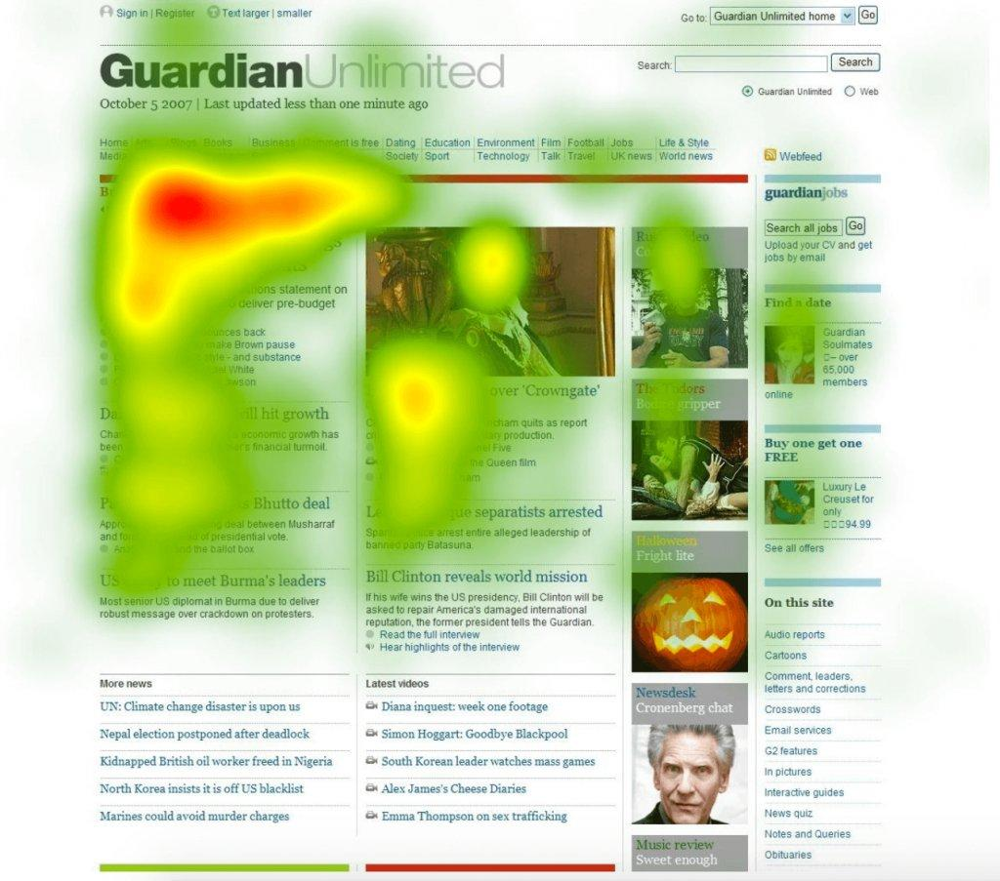

# Usability

- [Usability](#usability)
  - [5 características que podríamos aplicar sobre el siguiente mapa de calor](#5-características-que-podríamos-aplicar-sobre-el-siguiente-mapa-de-calor)

## 5 características que podríamos aplicar sobre el siguiente mapa de calor

1. Las noticias de la columna izquierda, especialmente las primera noticia en la parte superior, es muy popular. Las columnas segunda, tercera, y cuarta reciben cada una menos atención que la anterior.
2. En la imagen de la segunda columna y la primera imagen de la tercera columna, se puede ver como el usuario tiene tendencia a hacer click en la cara de la persona si es un retrato.
3. Las noticias de la parte inferior de la página son ignoradas por completo.
4. El usuario tiene más tendencia a registrarse que iniciar sesión.
5. En la barra de navegación, el usuario suele hacer click en los links de la izquierda, siendo los links mas populares a la derecha "futbol" y "viajes".
