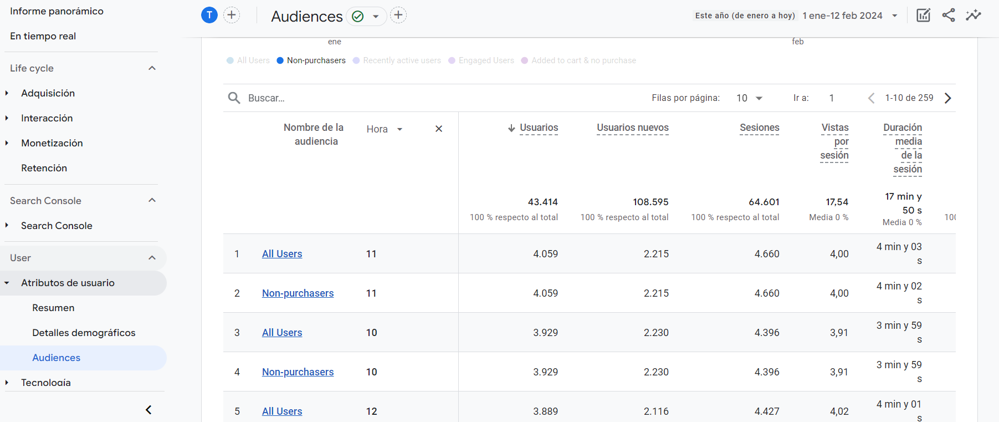
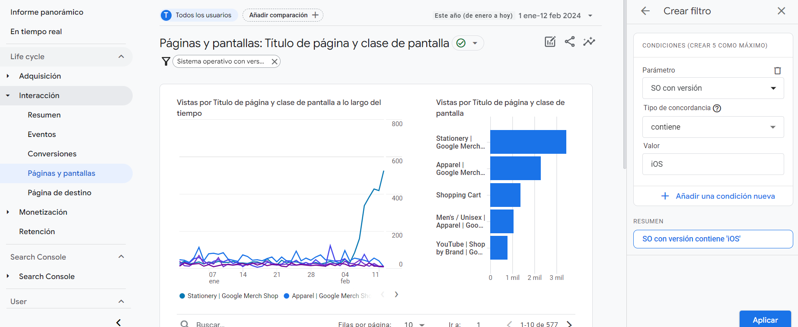
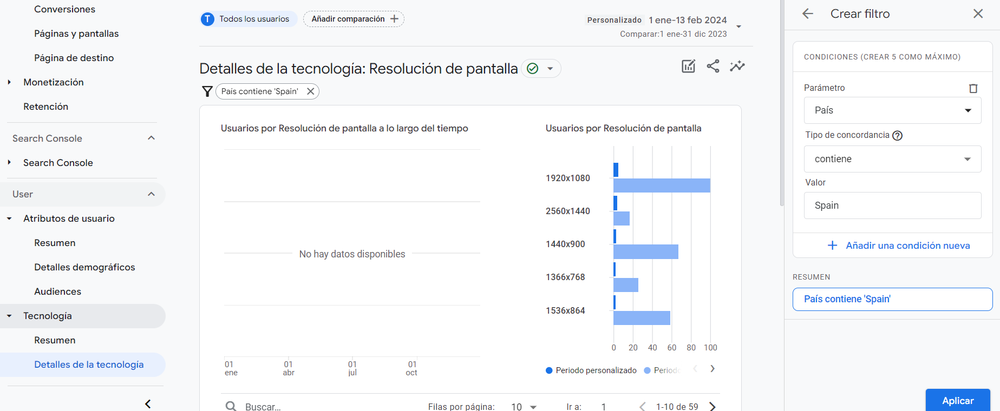
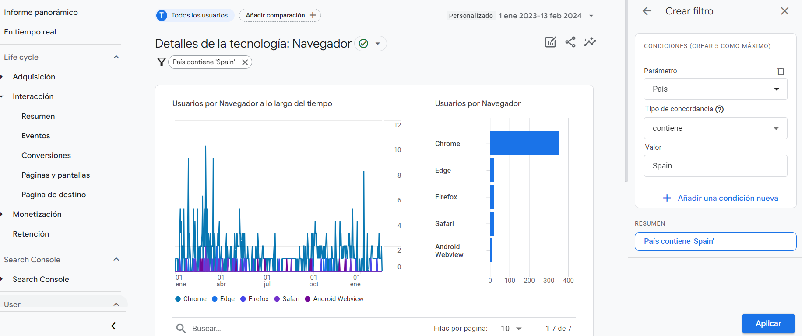
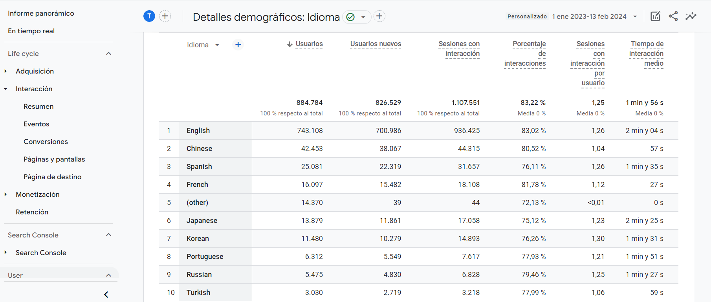
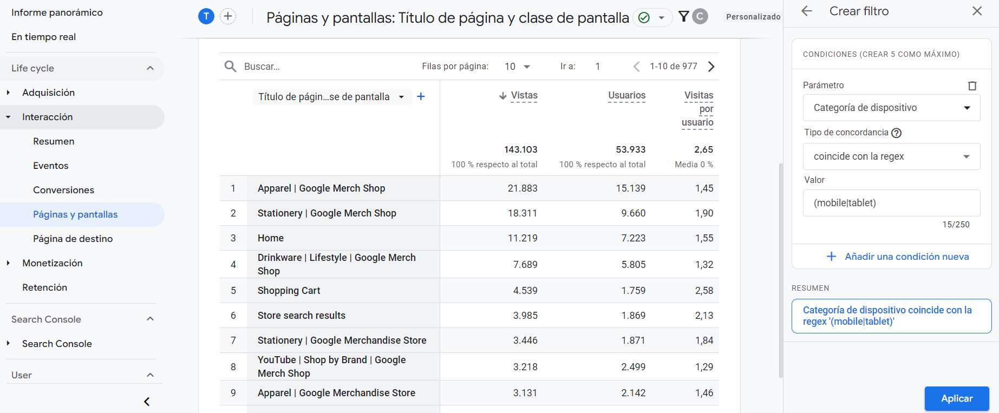

# Google Analitycs

- [Google Analitycs](#google-analitycs)
  - [Página usada para los ejercicios](#página-usada-para-los-ejercicios)
  - [Preguntas](#preguntas)

## Página usada para los ejercicios

Para este ejercicio se han usado los datos de la demo de Google Analytics de Google Merchandise Store.   

## Preguntas

- **¿A qué horas del día se ha conectado más la gente durante lo que llevamos de 2024?**
  
    **Instrucciones:** User --> Atributos de usuario --> Audiencias --> En la tabla de abajo, añadir la columna "Hora" --> En la esquina superior derecha, mostrar los datos desde el 1 de enero a la fecha actual (13 de enero).   

    **Resultado:** Entre las 10 y 12.   

       

- **¿Cuáles son las 3 páginas más vistas por los usuarios que utilizan Android? ¿Y IOS?**

    **Instrucciones:** Life cycle --> Interacción --> Páginas y pantallas --> Crear filtro para filtrar por Android/iOS --> En la tabla de abajo, mostrar por "Título de página y clase de pantalla" y ordenar por vistas --> Mostrar los datos de este año.   

    **Resultado:**   

        Android:   

        1. Stationery | Google Merch Shop
        2. Shopping Cart
        3. Apparel | Google Merch Shop

       

        iOS:   

        1. Stationery | Google Merch Shop
        2. Apparel | Google Merch Shop
        3. Shopping Cart

       

- **¿Cuáles son las principales resoluciones de pantalla que se conectan desde España? Comparalas con las del año anterior.**

    **Instrucciones:** User --> Tecnología --> Detalles de la tecnología --> En la tabla de abajo, mostrar datos de las "Resoluciones de pantalla" -> Crear un filtro para filtrar por el país España --> Comparar los datos de este año con los del año anterior.   

    **Resultado:**   

    1. 1920x1080
    2. 2560x1440
    3. 1440x900
   
    Al comparar con el año anterior, la resolución "2560x1440" era menos popular que "1440x900" y "1536x864".   

       

- **¿Cuáles son los 3 navegadores principales que utilizan los visitantes de España para conectarse a la web?**

    **Instrucciones:** User --> Tecnología --> Detalles de la tecnología --> En la tabla de abajo, mostrar datos del "Navegador" -> Crear un filtro para filtrar por el país España --> Comparar los datos de este año con los del año anterior.   

    **Resultado:**   

    1. Chrome
    2. Egde
    3. Firefox

       

- **¿Crees que es necesario desarrollar la página en el idioma "ruso"? Justifica tu respuesta.**

    **Instrucciones:** User --> Atributos de usuario --> Detalles demográficos --> En la tabla de abajo, mostrar datos del "Idioma" --> Comparar los datos de este año con los del año anterior.   

    **Justificación:**   

    Aunque es cierto que el ruso está en el top 10 de idiomas, actualmente se encuentra en la 9ª posición, siendo superado por otros idiomas como el chino, el español, o el japonés. Así que aunque desarrollar la página en ruso sería una buena opción, no es una prioridad.   

       

- **¿Cuáles fueron las páginas más vistas en diciembre de 2023 por los usuarios de móvil (incluyendo tablets)?**

    **Instrucciones:** Life cycle --> Interacción --> Páginas y pantallas --> En la tabla de abajo, mostrar datos del "Título de página y clase de pantalla" --> Crear un filtro para filtrar por el regex `(mobile|tablet)` --> Mostrar los datos de diciembre de 2023.   

    **Resultado:**   

    1. Apparel | Google Merch Shop
    2. Stationery | Google Merch Shop
    3. Home

       
